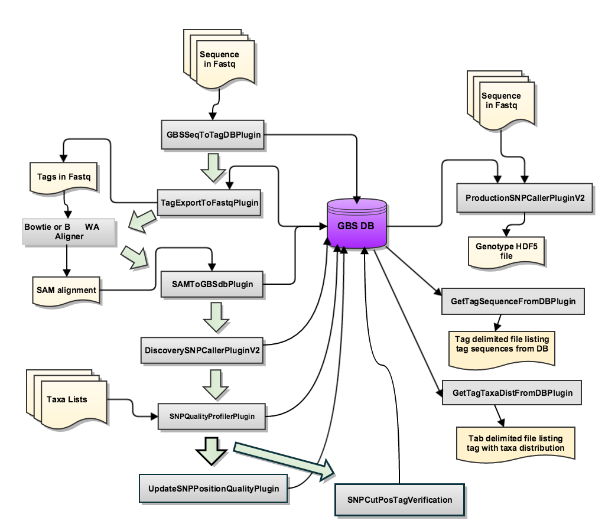
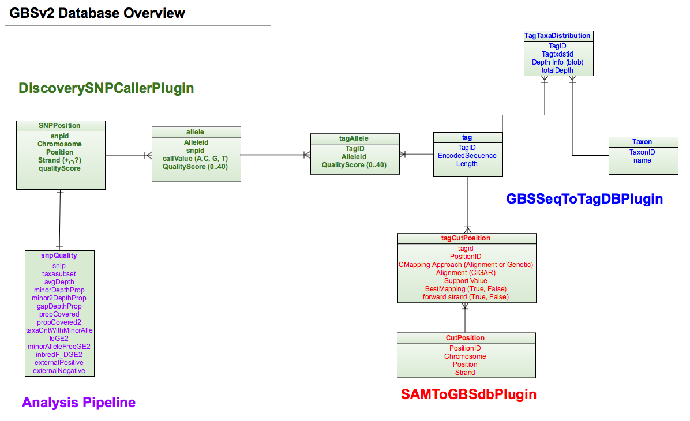

GBS v2 Pipeline
=================================================

Wiki website: `GBSv2Pipeline <https://bitbucket.org/tasseladmin/tassel-5-source/wiki/Tassel5GBSv2Pipeline>`_

=================================================
Summary
=================================================
GBS version2 is trying to keep all the information in a single database. To make it much more tidy and precise. In each step, we can choose whether to cover the old database or not.
There are two main pipeline workflows, one is dealing with the database (Discovery Pipeline); the other is for output files (Production Pipeline).

**Structure of the GBS V2 pipeline:**

1. *Discovery Pipeline* is to make the annotation and find the SNPs;
2. *Production Pipeline* is to make the output files that we can easily to read or do the downstream analysis.

=================================================
Essential files Overview 
=================================================
**FASTAQ** -- File format

[when you get your FASTQ data, you should copy the type and make the annotation here, here shows the basic.]

- *Basic Statistics* 
- *Per Base Sequence Quality*
- *Per Sequence Quality Scores*
- *Per Base Sequence Content*
- *Per Sequence GC content*
- *Per Base N Content*
- *Sequence Length Distribution*
- *Sequence Duplication Levels*
- *Overrepresented Sequences*
- *Adapter Content*
- *Kmer Content*

**Keyfile**

Four required headers: Flowcell, Lane, Barcode and FullSampleName.

*TIPS*

- It is not necessary for the required column to be consecutive;
- It is case-sensitive -- should be exact the same;
- Additional columns will be annotations;
- FullSampleName should be different -- otherwise they'll all merged and processes together. 

**referenceGenome**

Q & A
-----------------

Q1. What do PlateName, Row and Column HERE mean?

Q2. How to decide the reference? What potential problems will it contain? Diploid and tetraploid?

Q3. The info of our reference genome -- the species, how large, quality, how to define it...

=================================================
Discovery Pipeline Overview 
=================================================
## Steps and related input / ouput files

## Related parameters

Step1 (GBSSeqToTagDBPlugin)
-------------------------------------------------

FASTAQ files( */disk2/Twyford_GBS_illumina/* ); Key File ( */localdisk/home/s1950737/Diploid/DipKey.txt* ) ==>> GBSV2.db ( */localdisk/home/s1950737/Diploid* )

Parameters (#D=default, R=required input):

- ``-c (D=10)`` <Min Kmer Count>: `Kmers <https://en.wikipedia.org/wiki/K-mer>`_ count times; discard if it is no more than c. !!!All taxa, not each individual taxon.

- ``-db (R)`` <Output Database File>

- ``-deleteOldData (D=true)`` < true | false> :true for cover, false for append (sometimes may contain some problems)

- ``-e (R)`` <Enzyme> 

- ``-i (R)`` <Input Directory>: Input directory containing FASTQ files in text or gzipped text. !!No slash in the directory

- ``-k (R)`` <Key File> 

- ``-mnQS (D=0)`` <Minimum quality score>

- ``-kmerLength (D=64)`` <Kmer Length> : *longest barcode + kmerlength* must < read length

- ``-minKmerL (D=20)`` <Minimum Kmer Length> : cut by a second cut site after the kmer finding process, this parameter is to ensure the minimum length kmer exists.

- ``-mxKmerNum (D=50000000)`` <Maximum Number of Kmers> 

- ``-batchSize (D=8)`` <Number of flow cells processed simultaneously> 

Step2 (TagExportToFastqPlugin): 
-------------------------------------------------

GBSV2.db ( */localdisk/home/s1950737/Diploid* ) ==>> tagsForAlign.fa.gz ( */localdisk/home/s1950737/Diploid* )

- ``-c (D=1)`` <Min Count>: Minimum count of reads for a tag to be output

- ``-db (R)`` <Input DB>

- ``-0 (R)`` <Output File>: Output fastq file to use as input for BWA

Step3 (BWA alingment)
-------------------------------------------------

     Step3-1: create an index from the reference genome 

refereance genome ( */localdisk/home/s1950737/referenceGenome* ) ==>> several index files -- bwt, pac, ann, sa ( */localdisk/home/s1950737/referenceGenome* )

     Step3-2: alignment

reference genome ( */localdisk/home/s1950737/referenceGenome* ); tagsForAlign.fa.gz ( */localdisk/home/s1950737/Diploid* ) ==>> tagsForAlign.sai ( */localdisk/home/s1950737/bwa* )

     Step3-3: to creat sam file

reference genome ( */localdisk/home/s1950737/referenceGenome* ); tagsForAlign.fa.gz ( */localdisk/home/s1950737/Diploid* ); tagsForAlign.sai ( */localdisk/home/s1950737/bwa* ) ==>> tagsForAlign.sam ( */localdisk/home/s1950737/bwa* ) 

Step4 (SAMToGBSdbPlugin)
-------------------------------------------------
**Determine the potential positions of Tags against the reference genome**

tagsForAlign.sam ( */localdisk/home/s1950737/bwa* ) ==>> GBSV2.db ( */localdisk/home/s1950737/Diploid* )

- ``-aLen (D=0)`` < Minimum length of aligned base pair to store the SAM entry>

- ``-aProp (D=0)`` <Minimum proportion of sequence that must align to store the SAM entry>

- ``-i (R)`` <SAM Input file>

- ``-db (R)`` <GBS DB file>

- ``-minMAPQ (D=0)`` < Minimum value of MAPQ field to store the SAM entry >

- ``-deleteOldData (D=true)`` 

Step5 (DiscoverySNPCallerPluginV2)
-------------------------------------------------
**Identify SNPs from the aligned tags**

 GBSV2.db ( */localdisk/home/s1950737/Diploid* ) ==>> GBSV2.db ( */localdisk/home/s1950737/Diploid* ) 

- ``-callBiSNPsWGap (D=false)`` Include sites where the third allele is a GAP (mutually exclusive with inclGaps) (Default: false) *This option has not yet been implemented.*

- ``-db (R)`` <Input GBS Database>

- ``-gapAlignRatio`` <Gap Alignment Threshold>: indel contrasts to non indel contrasts [IC/(IC+NC)]

- ``-inclGaps (D=false)`` Include sites where major or minor allele is a GAP *This option has not yet been implemented.*

- ``-inclRare (D=false)`` Include the rare alleles at site (3 or 4th states) *This option has not yet been implemented.*

- ``-maxTagsCutSite (D=64)`` <Max tags per cut site position>: Maximum number of tags allowed per cut site when aligning tags . All cut site positions and their tags are stored in the database, but alignment of tags at a particular cut site position only occurs when the number of tags at this position is equal to or less than maxTagsPerCutSite. This guards against software degradation when a position has hundreds or thousands of associated tags.

- ``-mnLCov (D=0.1)`` <Minimum Locus Coverage>: proportion of Taxa with a genotype. 

- ``-mnMAF (D=0.01)`` <Minimum `Minor Allele Freq <https://en.wikipedia.org/wiki/Minor_allele_frequency>`_ >

- ``-ref (D=no reference genome)`` <Reference Genome File>

- ``-sC`` <Start Chromosome>:  If missing, processing starts with the first chromosome (lexicographically) in the database.

- ``-eC`` <End Chromosome>

- ``-deleteOldData (D=true)`` 

Step6 (SNPQualityProfilerPlugin)
-------------------------------------------------
**This plugin scores all discovered SNPs for various coverage, depth and genotypic statistics for a given set of taxa. If no taxa are specified, the plugin will score all taxa currently stored in the data base. If no taxa file is specified, the plugin uses the taxa stored in the database.**

- ``-db (R)`` <Output Database file>

- ``-deleteOldData (D=true)`` 

- ``-taxa`` <Taxa sublist file>

- ``-tname`` <Taxa set name >

- ``statFile`` <Quality information output name >

Step7 (UpdateSNPPositionQualityPlugin)
-------------------------------------------------
**To annotate the SNP quality in user's way**

- ``-db (R)`` < Input Database>

- ``-qsFile (R)`` <Quality Score File>

Step8 (SNPCutPosTagVerification)
-------------------------------------------------
**For users who want to specify a Cut or SNP position**

- ``-db (R)`` < Input Database>

- ``-chr (R)`` <Chromosome> : Chromosome containing the position.

- ``-pos (R)`` A cut or SNP position number.

- ``-strand (R)`` The strand direction: 0=reverse, 1=forward

- ``-type`` The type of position, either cut or snp, for which the taxa distribution will be presented.

- ``-outFile (R)`` 

=================================================
Production Pipeline Overview 
=================================================
**ProductionSNPCallerPluginV2 -- this plugin converts data from fastq and keyfile to genotypes, then adds these to a genotype file in VCF and HDF5 format.**

- ``-batchSize (D=8)`` <Batch Size> : Number of flow cells to process simultaneously. 

- ``-d (D=0)`` <Max Divergence> : Maximum divergence (edit distance) between new read and previously mapped read (Default means perfect matches only) 

- ``-db (R)`` <Input GBS Database> 

- ``-e (R)`` <Enzyme> 

- ``-eR (D=0.01)`` <Ave Seq Error Rate> : Average sequencing error rate per base (used to decide between heterozygous and homozygous calls) 

- ``-i (R)`` <Input Directory> 

- ``-k (R)`` <Key File> 

- ``-ko (D=false)`` Keep HDF5 genotypes file open for future runs that add more taxa or more depth 

- ``-kmerLength (D=64)`` <Length of Kmer> : Lemgth of kmers to grab from fastQ sequences. **This value should match the kmerLength parameter value used in the GBSSeqToTagDBPlugin step of the pipeline.** Bad values may be stored in the HDF5 file if these values are inconsistent. 

- ``-minPosQS (D=0)`` < Minimum Quality Score> : The minimum quality score a SNP position must have to be output to the HDF5 file. The quality scores are loaded into the database via the tab-delimited file read in from the UpdateSNPPositionQualityPlugin. A value of 0 indicates all positions should be processed. 

- ``-mnQS (D=0)`` < Minimum Quality Score> : The minimum quality score within the barcode and read length for a position to be accepted. This filters the read values from the fastQ files. 

- ``-do (D=true)`` write depths to the output HDF5 genotypes file.

- ``-o (R)`` <Output Genotypes File>: VCF format is the default. if the file specified has suffix ".h5" output will be to an HDF5 file. (REQUIRED)

=================================================
Q & A 
=================================================
1. What do I need for my research?
2. What does each step mean? Do I need them all?
3. Does my pilot run contain any problems? (Except for the default?)
