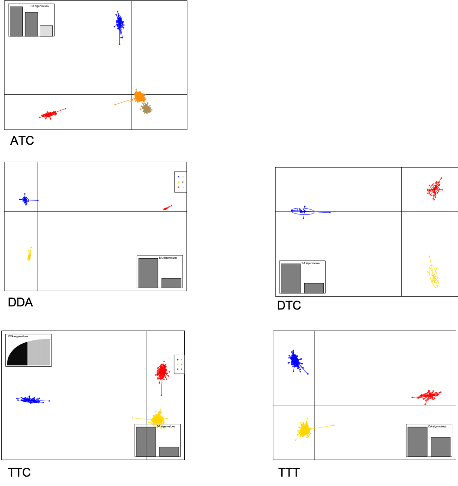
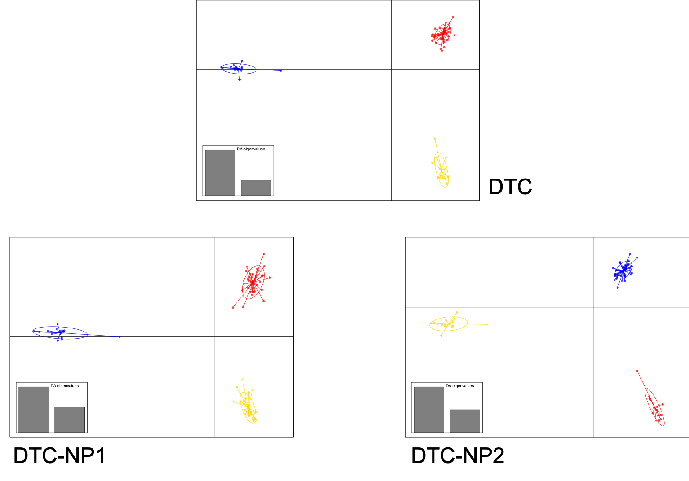
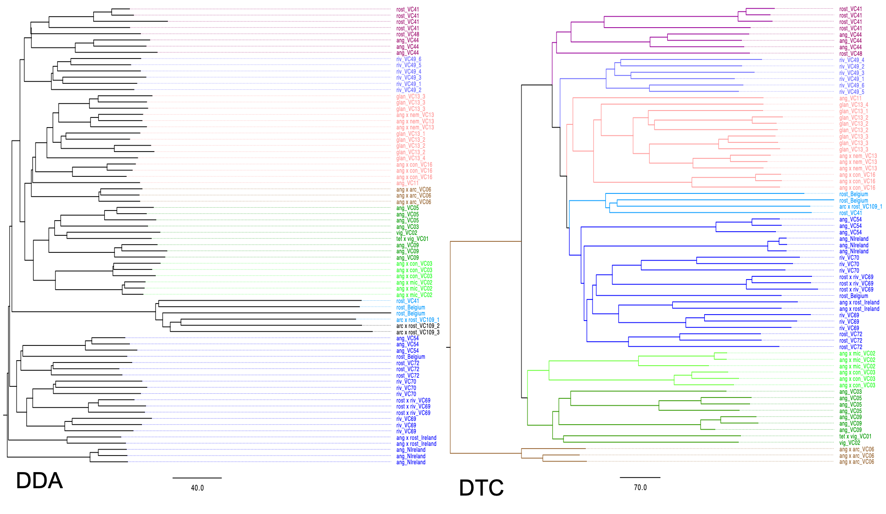
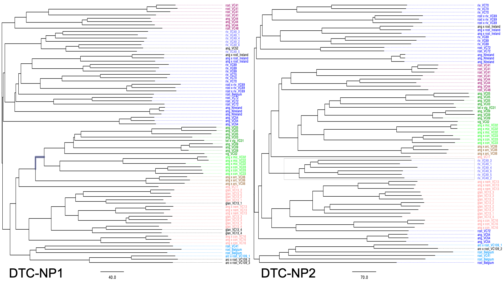

Tetraploid reference
=================================================

Here, we compare different samples (DIP/TET/ALL) with different scaffolds (conserved/tetraploid/all) of E. arctica as reference genome

=================================================
TASSEL-GBS (SNP Calling)
=================================================

Essential files
-------------------------------------------------
*FASTAQ:* /disk2/Twyford_GBS_illumina

*KEYFILE:* 

  Tetraploids: /localdisk/home/s1950737/SNPCall/keyfile/TetKey.txt

  Diploids: /localdisk/home/s1950737/SNPCall/keyfile/DipKey.txt

  ALL: /localdisk/home/s1950737/SNPCall/keyfile/AllKey.txt

*REFERENCE GENOME:* /disk2/hbecher_tmp/remap/scaffolds_disom_concat_dipOrTet.fasta

*SCAFFOLDS FILTER:* 

  Conserved scaffolds: /loaldisk/home/s1950737/SNPCall/scaffolds/uni.tsv

  Tetraploid scaffolds: /loaldisk/home/s1950737/SNPCall/scaffolds/tet.tsv

Steps
-------------------------------------------------
**Get SAM files:TASSEL-GBS PIPELINE**

*Step1: GBSSeqToTagDBPlugin*
::

  ./run_pipeline.pl -Xms100G -Xmx200G -GBSSeqToTagDBPlugin -db /FILEPATH/GBS.db -e ApeKI -i /disk2/Twyford_GBS_illumina -k /FILEPATH/KEYFILE.txt 

*Step2: TagExportToFastqPlugin*
::

  ./run_pipeline.pl -TagExportToFastqPlugin -db /FILEPATH/GBS.db -o /FILEPATH/tagsForAlign.fa.gz -c 1 -endPlugin

*Step3: Alingment*

*Step3-1: create an index from the reference genome*
::

  cp /disk2/hbecher_tmp/remap/scaffolds_disom_concat_dipOrTet.fasta .
  ./bwa index -a bwtsw ../referenceGenome/tet/scaffolds_disom_concat_dipOrTet.fasta

*Time consumed: 16:30 13/04/20 - 17:00 13/04/20; 30 minute*

*Step3-2: Aligment*
::

  ./bwa aln -t 4 ../referenceGenome/tet/scaffolds_disom_concat_dipOrTet.fasta ../FILEPATH/tagsForAlign.fa.gz > tagsForAlign.sai
  ./bwa samse ../referenceGenome/tet/scaffolds_disom_concat_dipOrTet.fasta tagsForAlign.sai ../FILEPATH/tagsForAlign.fa.gz > tagsForAlign.sam

**Filter SAM files with SCAFFOLDS FILTER TXT-samtools**
::

  samtools view -bh tagsForAlign.sam > tagsForAlign.bam
  samtools sort tagsForAlign.bam > OUT.bam
  samtools index -c OUT.bam
  cat uni.tsv | tr "\n" " " | xargs samtools view -h OUT.bam > output.sam

**SNP calling**

*Step4: SAMToGBSdbPlugin*
::

  ./run_pipeline.pl -SAMToGBSdbPlugin -i ../FILEPATH/output.sam -db ../FILEPATH/GBS.db

*Step5: DiscoverySNPCallerPluginV2*
::

  ./run_pipeline.pl -DiscoverySNPCallerPluginV2 -db ../FILEPATH/GBS.db

*Step6: ProductionPipeline ProductionSNPCallerPluginV2*
::

  ./run_pipeline.pl -Xms100G -Xmx200G -ProductionSNPCallerPluginV2 -db ../FILEPATH/GBS.db -e ApeKI -i /disk2/Twyford_GBS_illumina -k ../FILEPATH/KEYFILE.txt -o ../FILEPATH/OUTPUT.vcf

TIME CONSUMED
------------------------------------------------

+------+-----------+-------+-------+---------+-------+---------+-------+-------+----------+
| DATA | SCAFFOLDS | STEP1 | STEP2 | STEP3-2 | STEP4 | STEP5   | STEP6 | TOTAL | DATE     |
+======+===========+=======+=======+=========+=======+=========+=======+=======+==========+
| TET  | conserved | 70m   | 12m   | 6m      | 1m    | 20m     | 38m   | 2.45h | 14/04/20 |
+------+-----------+-------+-------+---------+-------+---------+-------+-------+----------+
| TET  | tetraploid| 43m   | 6m    | 4m      | 3m    | 3h      | 40m   | 4.6h  | 29/04/20 |
+------+-----------+-------+-------+---------+-------+---------+-------+-------+----------+
| DIP  | conserved | 11m   | 1m    | <1m     | 10s   | 6m      | 12m   | 0.5h  | 15/04/20 |
+------+-----------+-------+-------+---------+-------+---------+-------+-------+----------+
| ALL  | conserved | 47m   | 13m   | 2m      | 1m    | 25m     | 56m   | 2.4h  | 28/04/20 |
+------+-----------+-------+-------+---------+-------+---------+-------+-------+----------+
| ALL  | all       | 40m   | 14m   | 4m      | 3m    | 1d13h20m| 63m   | 1.5d  | 28/04/20 |
+------+-----------+-------+-------+---------+-------+---------+-------+-------+----------+

=================================================
PLINK (SNP Filtering) & DAPC TEST
=================================================
FILTERING
------------------------------------------------
**Check the missing data**

*make missing data with individuals & sites*

Setting the rule: keep ~90% taxa & 20% sites, maf = 0.05, thus, for samples, ALL(776/862); TET(704/782); DIP(72/80)
 
+------+-----------+---------+---------+-----------------+--------------------+----------------+--------+----------------+--------+
| ITEM | vcf(size) | vcf.gz  | bi-vcf  | SITES           | SITES-LEFT         | INI-FILTER     | SIZE   | LESS-FILTER    | SIZE   |
+======+===========+=========+=========+=================+====================+================+========+================+========+
| ATA  | 5.84GB    | 328.9MB | 6.01GB  |                 |                    |                |        |                |        |
+------+-----------+---------+---------+-----------------+--------------------+----------------+--------+----------------+--------+
| ATC  | 360.9MB   | 19.6MB  | 394.9MB | 27,513(26,623)  | ~5502(5324)        | 0.80/0.35/0.05 | 21MB   | 0.75/0.20/0.05 | 11.5MB |
+------+-----------+---------+---------+-----------------+--------------------+----------------+--------+----------------+--------+
| DDA  | 143.5MB   | 9.9MB   | ---     | 100,903         | ~20,180            | 0.72/0.25/0.05 | 10.9MB | 0.72/0.10/0.05 | 5.9MB  |
+------+-----------+---------+---------+-----------------+--------------------+----------------+--------+----------------+--------+
| DTC  | 14.4MB    | ---     | ---     | 10,035          | ~2,007             | 0.75/0.25/0.05 | 1.2MB  | 0.75/0.20/0.05 | 993KB  |
+------+-----------+---------+---------+-----------------+--------------------+----------------+--------+----------------+--------+
| TTC  | 346.6MB   | 17.4MB  | 335.9MB | (24947)         | ~(4989)            | 0.80/0.35/0.05 | 18MB   | 0.75/0.20/0.05 | 9.8MB  |
+------+-----------+---------+---------+-----------------+--------------------+----------------+--------+----------------+--------+
| TTT  | 844.8MB   | 46.5MB  | 924.4MB | 70,844(68,574)  | ~14,168(13,714)    | 0.80/0.35/0.05 | 49.5MB | 0.75/0.20/0.05 | 27.3MB |
+------+-----------+---------+---------+-----------------+--------------------+----------------+--------+----------------+--------+

For those contain tetraploid samples (TET/ALL), should exclude more than 2 alleles sites first:
::

  vcftools --vcf VCF.vcf --min-alleles 2 --max-alleles 2 --recode --out bi-VCF

Then, use plink to finish the initial filter/less missing data filter:
::

  ./plink --file ITEM.plk --allow-extra-chr --mind 0.75 --maf 0.01 --geno 0.10 --recode vcf-iid --out ITEM-INI

Then, using less-missing data to do the DAPC(R):
::

  library(vcfR)
  library(poppr)
  library(ape)
  library(RColorBrewer)
  library(reshape2)
  library(ggplot2)
  
  # load and check out vcf data set:
  lm.vcf <- read.vcfR('./LessMissing/ATC-LESS.vcf')

  # turn into the vcf data to genlight:
  gl.lm <- vcfR2genlight(lm.vcf)
  ploidy(gl.lm) <- 2

  #this is interactively choose the K, use Kmeans as default
  grp_lm_k <- find.clusters(gl.lm, n.pca = 300) #interactive, pca = 300; k=3
  plot(grp_lm_k$Kstat, type="b", xlab="number of clusters (K)", ylab="BIC", col="blue", main="Detection based on BIC")
  points(3, grp_lm_k$Kstat[3], pch="x", cex=2)
  mtext(3, tex="'X' indicates the actual number of clusters")

  # check out in find.cluster groups
  x1 <- grp_lm_k$grp #k=3
  write.csv(x1, file = 'ATC-K3.csv')

  ## dapc
  lm.dapc <- dapc(gl.lm, pop = factor(x1), n.pca = 30, n.da = 100)  ##not quite sure about n.da
  scatter(lm.dapc, cex = 1.5, legend = TRUE, clabel = F, scree.pca = FALSE, posi.da = "bottomright", cleg = 0.75)

DAPC RESULTS
------------------------------------------------

**Cluster Details: see the file**

=================================================
TEST DIFFERENT PARAMETERS
================================================= 
**KEY POINT: kmer=80, change step: step 1(GBSSeqToTagDBPlugin) & step 5(DiscoverySNPCallerPluginV2)**

*DETAILS:*

STEP1(GBSSeqToTagDBPlugin): 
 P1:     1. Min Kmer Count(-c=30); 
 
 P1:     2. Minimum quality score (-mnQS=30);
 
 P1, P2: 3. Minimum Kmer length (-kmerlength=80)

STEP2(TagExportToFastqPlugin):
 P1: 1. Min count (-c=5)

STEP5(DiscoverySNPCallerPluginV2)
 P1: 1. Max tags per cut site position (-maxTagsCutSite=80);

 P1: 2. Minimum Minor Allele Freq (-mnMAF=0.05)

Production
 P1, P2: 1. length of Kmer (-kmerLength=80);

 P1:     2. minimum quality score (-mnQS=30)

TEST DATASET: DIP-TET-CON

+--------+-------+-------+---------+-------+---------+-------+-------+----------+--------+--------+-------+----------------+
| DATA   | STEP1 | STEP2 | STEP3-2 | STEP4 | STEP5   | STEP6 | TOTAL | DATE     | SIZE   | SITES  | LEFT  | INITIAL-FILTER |
+========+=======+=======+=========+=======+=========+=======+=======+==========+========+========+=======+================+
| DTC    | 11m   | 1m    | <1m     | 10s   | 6m      | 12m   | 0.5h  | 14/04/20 | 14.4MB | 10,035 | 2,007 | 0.75/0.25/0.05 |
+--------+-------+-------+---------+-------+---------+-------+-------+----------+--------+--------+-------+----------------+
| DTC-P1 | 17m   | <1m   | 17s     | 5s    | 4m      | 15m   | 0.55h | 06/05/20 | 5.7MB  |  3,714 | 1,500 | 0.78/0.30/0.05 |
+--------+-------+-------+---------+-------+---------+-------+-------+----------+--------+--------+-------+----------------+
| DTC-P2 | 17m   | <1m   | <1m     | 5s    | 6m      | 17m   | 0.6h  | 06/05/20 | 16.2MB | 11,297 | 2,260 | 0.75/0.25/0.05 |
+--------+-------+-------+---------+-------+---------+-------+-------+----------+--------+--------+-------+----------------+

Then, do the DAPC analyses and phylogeny tree using VCF2PopTree, parameters:

  1. Distance: Genetic distance;

  2. Missing Data: Use SNVs for each pair of genomes;

  3. Model: Number of differences;
 
  4. Construct Tree: Neighbour-Joining tree (Unrooted);

  5. Output format: Newick tree

DAPC RESULTS
------------------------------------------------

PHYLOGENY RESULTS
------------------------------------------------

=================================================
ERROR & SOLUTION INFO
=================================================  
1. when in plink, filter SNPs, comes the following error:
::

  Error: More than 4 different alleles at variant 21566. 

**Solution1:** use `GATK <https://gatk.broadinstitute.org/hc/en-us/articles/360036362532-SelectVariants>`_

::

  ##Picard, to produce reference genome for next step:
  wget https://github.com/broadinstitute/picard/releases/download/2.22.3/picard.jar 
  # test it is fine
  java -jar /localdisk/home/s1950737/gatk-4.1.6.0/picard.jar -h 
 
  ## these two are creating reference genome format (.fai):  
  java -jar picard.jar CreateSequenceDictionary R= ../referenceGenome/tet/scaffolds_disom_concat_dipOrTet.fasta O= tet.dict
  samtools faidx ../referenceGenome/tet/scaffolds_disom_concat_dipOrTet.fasta 

  ##index needed:
  bgzip -c tet.vcf > tet.vcf.gz
  tabix -fp vcf tet.vcf.gz 

  ##select biallelic variants
  ./gatk SelectVariants -R ../referenceGenome/tet/scaffolds_disom_concat_dipOrTet.fasta -V ../bi-tet/tet2.vcf --restrict-alleles-to BIALLELIC -O ../bi-tet/ouput2.vcf  
  # didn't work, don't know why

**Solution2:** use `vcftools <https://vcftools.github.io/man_latest.html>`_
::

  vcftools --vcf tet.vcf --min-alleles 2 --max-alleles 2 --recode bi-tet.vcf
  vcftools --vcf tet.vcf --min-alleles 1 --max-alleles 2 --recode tet1-2.vcf #try to see the difference

