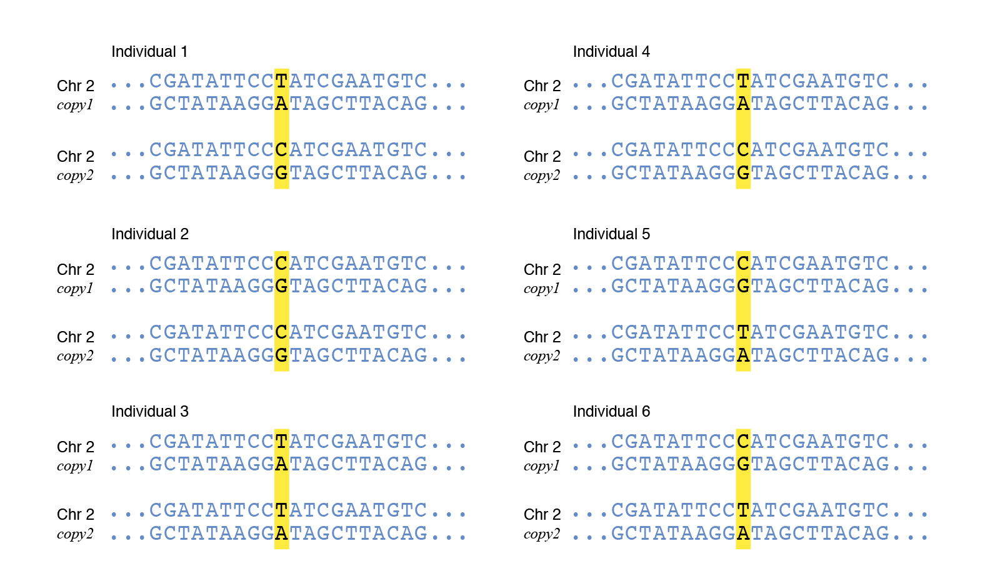
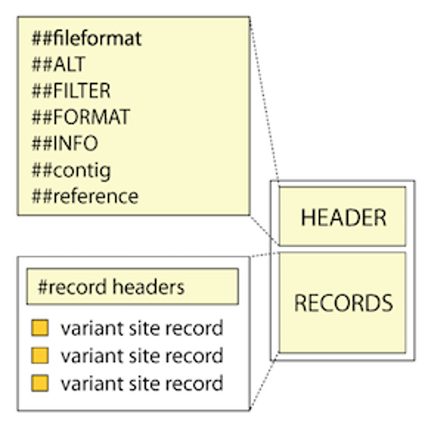

VCFfiles
=================================================

=================================================
20200114 VCF2PopTree
=================================================

Reference: `PeerJ <https://peerj.com/articles/8213.pdf>`_

Github download: `VCF2PopTree <https://github.com/sansubs/vcf2pop>`_

**MEGA1**
::

  Minimum quality score: 80
  Minimum coverage depth: 100
  Distance: Genetic Distance
  Missing Data: Use SNVs for each pair of genomes
  Model: Number of differences
  Construct Tree: UPGMA Tree
  Output format: Pair-wise diversity(MEGA)
  Select genomes: All

  ****

=================================================
Basics in VCF Notes
=================================================

References
-------------------------------------------------

Chinese version 

`变异信息那些事 <https://www.jieandze1314.com/post/cnposts/variant/>`_

`VCF格式 <https://www.jianshu.com/p/957efb50108f>`_

English version

`What is a VCF and how should I interpret it? <https://gatkforums.broadinstitute.org/gatk/discussion/1268/what-is-a-vcf-and-how-should-i-interpret-it>`_

Aims for this notes
-------------------------------------------------

  1. Explanation for my own VCF files in different version;

  2. Understand better about my data before moving to downstream analyses. 

Basics in VCF
-------------------------------------------------
**VCF: Variant Call Format** It is a standardized text file format for representing SNP, indel, and structural variation calls. 

*SNP: Single nucleotide polymorphisms* `Definition <https://www.genome.gov/genetics-glossary/Single-Nucleotide-Polymorphisms>`_

  
- Assembly: *here should be a link added later to study with assembly*

    1. De novo assembly from the start will get a integrated genome from one chromosome;
    2. SNPs happens after mapping(alignment) step -- and is two chromosomes (diploid) or more (polyploid) with two strands of DNA. Those showed in SNP data files as 'heterozygosity' means there're two or more different types of nucleotides in one site, it might be: 1) sequence error; 2) difference from maternal and paternal (the true consequence of 'heterozygosity'); 3) SNP from DNA duplication. 

**okay, still confused here, look back later. Main struggling here is DNA strands, chromatids, chromosomes, etc. Might get answers after learning the assembly stuff, now continue the VCF file first**

=================================================
VCF file from TASSEL-GBS
=================================================
Header
-------------------------------------------------
::

  ##fileformat=VCFv4.0
  ##Tassel=<ID=GenotypeTable,Version=5,Description="Reference allele is not known. The major allele was used as reference allele">
  ##FORMAT=<ID=GT,Number=1,Type=String,Description="Genotype">
  ##FORMAT=<ID=AD,Number=.,Type=Integer,Description="Allelic depths for the reference and alternate alleles in the order listed">
  ##FORMAT=<ID=DP,Number=1,Type=Integer,Description="Read Depth (only filtered reads used for calling)">
  ##FORMAT=<ID=GQ,Number=1,Type=Float,Description="Genotype Quality">
  ##FORMAT=<ID=PL,Number=.,Type=Float,Description="Normalized, Phred-scaled likelihoods for AA,AB,BB genotypes where A=ref and B=alt; not applicable if site is not biallelic">
  ##INFO=<ID=NS,Number=1,Type=Integer,Description="Number of Samples With Data">
  ##INFO=<ID=DP,Number=1,Type=Integer,Description="Total Depth">
  ##INFO=<ID=AF,Number=.,Type=Float,Description="Allele Frequency">

``##fileformat`` is the VCF version, sometimes will influence the downstream analyses;

``##TASSEL`` is similar as ``##FILTER`` in elsewhere, I'm not quite sure why here is no information of reference allele.

``##FORMAT`` & ``##INFO`` define the annotations contained in the ``FORMAT`` & ``INFO`` columns of the VCF file, details are in the following.

Variant call records
-------------------------------------------------
For each site record, the information is structured into columns (also called fields) as follows:
::

  #CHROM POS ID REF ALT QUAL FILTER INFO FORMAT E4E0324_2 [other samples...]

The first 8 columns represent the properties observed at the level of the variant site. Sample-specific information such as genotype and individual sample-level annotation values are contained in the ``FORMAT`` column (9th column) and in the sample-name columns (10th beyond). 

**Site-level properties and annotations**

These first 7 fields  are required by the VCF format and must be present, although they can be empty (in practice, there has to be a dot, ie ``.`` to serve as a placeholder)

  - **CHROM and POS:** The contig and genomic coordinates on which the variant occurs.

  - **ID:** An optional identifier for the variant.

  - **REF and ALT:** The reference allele and alternative allele(s) observed in a sample, set of samples, or a population in general (depending how the VCF was generated). Note that REF and ALT are always given on the **forward strand**. **so, how to know how the VCF generated to get this information??**

  - **QUAL:** The `Phred-scaled <https://gatk.broadinstitute.org/hc/en-us/articles/360035531872-Phred-scaled-quality-scores>`_ probability that a REF/ALT polymorphism exists at this site given sequencing data. The larger, the more possibility of variant it could be -- but not very reliable.

  - **FILTER:** This field contains the name(s) of any filter(s) that the variant fails to pass, or the value ``PASS`` if the variant passed all filters. If the FILTER value is ``.`` , then no filtering has been applied to the records. 

This next field does not have to be present in the VCF.

  - **INFO:** Various site-level annotations.

**Sample-level annotations**

The short names of the sample-level annotations are recorded in the ``FORMAT`` field.

  - **GT-the Genotype of this sample at this site:** ``0`` means the same as ``REF`` , ``1`` means the first ``ALT`` , ``2`` means the second ``ALT`` , (and so on). For diploid:
   - ``0/0`` means the sample is homozygous reference
   - ``0/1`` means the sample is heterozygous, carrying 1 copy of each of the REF and ALT alleles
   - ``1/1`` means the sample is homozygous alternate
   - ``./.`` means missing data

  - **AD and DP: Allele depth and depth of coverage:** These are complementary fields that represent two important ways of thinking about the depth of the data for this sample at this site.
    
     **AD** is the unfiltered allele depth, i.e. the number of reads that support each of the reported alleles. In diploids, two values seperated by ``,`` , the former is REF, the latter is ALT.

     **DP** is the filtered depth, at the sample level. This gives you the number of filtered reads that support each of the reported alleles. 

  - **GQ-Quality of the assigned genotype:** represents the Phred-scaled confidence that the genotype assignment (GT) is correct, derived from the genotype PLs. The likelihood of second most likely variants, maximum is 99. The larger, the more possibility of supporting the best one is the 'best'.

  - **PL-"Normalized" Phred-scaled likelihoods of the possible genotypes:** for monomorphic site (which only has one ALT) in diploids, three numbers are given for evaluate the possibility of 0/0, 0/1, 1/1; "normalized" is quotes here because it's not real 'probabilities', just a way to show possibilities. For this, 0 is the most likely ones (which also showed in GT, if it's right)

**examples in my VCF**

First, no variant:

 - **E4E0072_3 the first site:** ``GT:AD:DP:GQ:PL 0/0:5,0:5:96:0,15,180``

  At this site, the called genotype is ``GT=0/0`` , which corresponds to a homozygous reference genotype with alleles ``T/T`` ; 

  The confidence indicated by ``GQ=96`` is good; means the second likely genotype is very low possibility, GT is reliable enough, also the degree of certainty in our genotype is evident in the PL field, where ``PL(0/0)=0`` (the normalized value that corresponds to a likelihood of 1.0) as is always the case for the assigned allele, the next PL is ``PL(0/1)=15`` , corresponding to 10^(-1.5), or 0.0316, actually is not very good, means there're still has the possibility to be ``T/C`` ; but the next one is very small, means there're nearly impossible to be ``C/C`` . 

  Others, there were a total of 5 informative reads at this site ( ``DP=5`` ), all of which supported the REF allele (=had the reference base) (indicated by ``AD=5,0`` ). 

  So, the conclusion is the genotype in this sample at this site is homozygous reference, no variant but has the possibility that it would be heterozygous, which is ``T/C`` it might because the reads coverage is too low (only 5), but it's impossible to be ``C/C`` .

Then, this variant is weird:
 
 - **AT1627_2 at the the site** ``16168`` at chromosome ``NODE_1007_LENGTH_33384_COV_15.053492``  **:** ``GT:AD:DP:GQ:PL 2/2:0,0,2:2:33:0,0,0,255,255,255``

 ``GT=2/2`` means genotype is ``A/A`` , homozygous second alternate;

 ``AD=0,0,2`` & ``DP=2`` means there were in total 2 informative reads at this site, all of which supported the second ALT allele (=had the alternate base); -- with so little coverage, we can not be sure that the genotype should not in fact be homozygous second alternate variant.

 ``GQ=33`` means the confidence is not very good, corresponding to 10^(-3.3), or 0.0005, indicating that even though this is probably a real variant (the QUAL is good), we are not sure we have the right genotype. 

 **Here comes the most weird thing:** ``PL(0/0:0/1:1/1)=0:0:0`` while ``PL(0/2:1/2:2/2)=255:255:255`` ==>> HOW CAN ``GT`` BE ``2/2`` ?

 